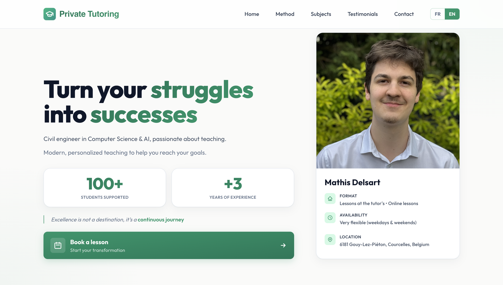

<div align="center">

# Tutoring Website

### Modern Personal Tutoring Website with Intelligent Contact Forms

Website: [mathisdelsart.github.io/TutoringWebsite/mathis-delsart](https://mathisdelsart.github.io/TutoringWebsite/mathis-delsart)

[](https://nextjs.org/)
[](https://www.typescriptlang.org/)
[](https://tailwindcss.com/)
[](https://pages.github.com/)

</div>

---



---

## Stack

- **Next.js 14** (App Router) + **TypeScript**
- **Tailwind CSS** with custom animations
- **Lucide React** icons
- FR / EN bilingual UI
- Static export → **GitHub Pages**

## Run locally

```bash
npm install
npm run dev
```

Then open [http://localhost:3000/mathis-delsart](http://localhost:3000/mathis-delsart).

---

<div align="center">

 &nbsp; **Mathis DELSART**

</div>
